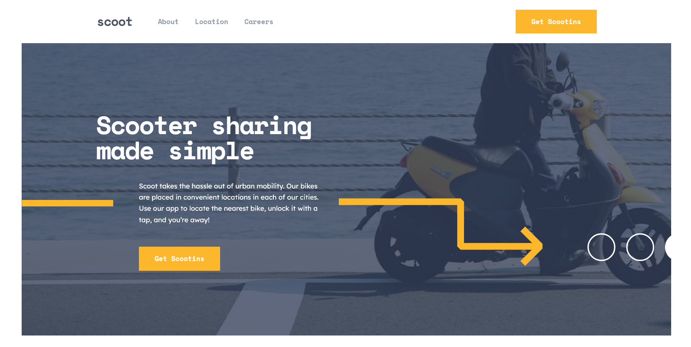

# Frontend Mentor - Scoot website solution

This is a solution to the [Scoot website challenge on Frontend Mentor](https://www.frontendmentor.io/challenges/scoot-multipage-website-N76alNPRJ). Frontend Mentor challenges help you improve your coding skills by building realistic projects. 

## Table of contents

- [Overview](#overview)
  - [The challenge](#the-challenge)
  - [Screenshot](#screenshot)
  - [Links](#links)
- [My process](#my-process)
  - [Built with](#built-with)
  - [What I learned](#what-i-learned)
  - [Continued development](#continued-development)
  - [Useful resources](#useful-resources)
- [Author](#author)
- [Acknowledgments](#acknowledgments)

## Overview

### The challenge

Users should be able to:

- View the optimal layout for each page depending on their device's screen size
- See hover states for all interactive elements throughout the site

### Screenshot

### Links

- Solution URL: [https://github.com/NaanaaAbdelmalek/scoot]
- Live Site URL: [https://naanaaabdelmalek.github.io/scoot/]

## My process

### Built with

- HTML5: Utilized semantic HTML elements for a more meaningful and accessible structure.
- CSS: Employed CSS for styling, with a focus on layout and design principles.
- Sass: Used Sass, a CSS preprocessor, to enhance styling capabilities through features like variables, nesting, and mixins.
- JavaScript: Applied JavaScript to add interactivity and dynamic elements to the web pages

### What I learned

During this project, I gained valuable experience with HTML5 semantic elements, enhancing the structure and meaning of web content for both users and search engines. I also focused on accessibility, ensuring that the web pages are usable by people with various disabilities, including those who rely on screen readers or navigate without a mouse. Additionally, I integrated Sass, a powerful CSS preprocessor, which significantly improved my styling workflow by allowing me to use features like variables, nested rules, and mixins, leading to more maintainable and efficient CSS code. 

### Continued development

Looking ahead, I plan to expand my skill set by learning Tailwind CSS, a utility-first CSS framework that will streamline styling with its pre-built classes and flexible design system. This will allow for faster development and more consistent, responsive designs. Additionally, I aim to dive into React.js, a powerful JavaScript library for building user interfaces. Mastering React will enable me to create dynamic, interactive web applications with a component-based architecture, further enhancing my front-end development capabilities.

### Useful resources

- [Sass Documentation](https://sass-lang.com/documentation/) - This is Sass official documentation which helped me understand it's basics. I'd recommend it to anyone who is willing to start out with Sass.
- [Fedmentor](https://fedmentor.dev/) - Great blog especially for juniors developers to develope strong accessible practices.
- [The A11Y project](https://www.a11yproject.com/) - The A11Y Project is a community-driven effort to make digital accessibility easier.

## Author

- Github - [@NaanaaAbdelmalek](https://github.com/NaanaaAbdelmalek)
- Frontend Mentor - [@NaanaaAbdelmalek](https://www.frontendmentor.io/profile/NaanaaAbdelmalek)
- Linkedin - [@naanaa-abdelmalek](https://www.linkedin.com/in/naanaaabdelmalek/)

## Acknowledgments

I would like to express my gratitude to the Frontend Mentor community on Discord for their invaluable support and feedback throughout this project. Their insights and collaborative spirit greatly contributed to the development process. Special thanks to the moderators who generously reviewed my work and provided guidance on the coding issues I encountered, helping me improve and refine my project. Your expertise and encouragement have been instrumental in my learning journey.
